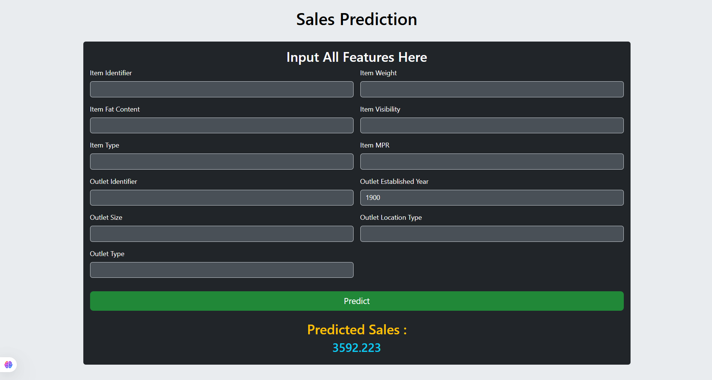

# Sales Prediction

A web application that predicts the sales of products in Big Mart outlets based on historical data and product/outlet features. Built with Python, scikit-learn, and Streamlit, this project demonstrates end-to-end machine learning—from data cleaning and feature engineering to model training and deployment.

## 🚀 Features

- **Data Preprocessing**: Handles missing values, outliers, and categorical encoding.
- **Feature Engineering**: Creates meaningful features (e.g., outlet age).
- **Modeling**: Trains a regression model (e.g., Random Forest / XGBoost) to predict sales.
- **Easy Deployment**: One-click run with Streamlit.

